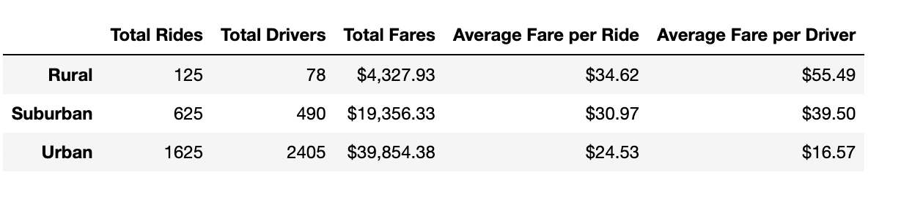
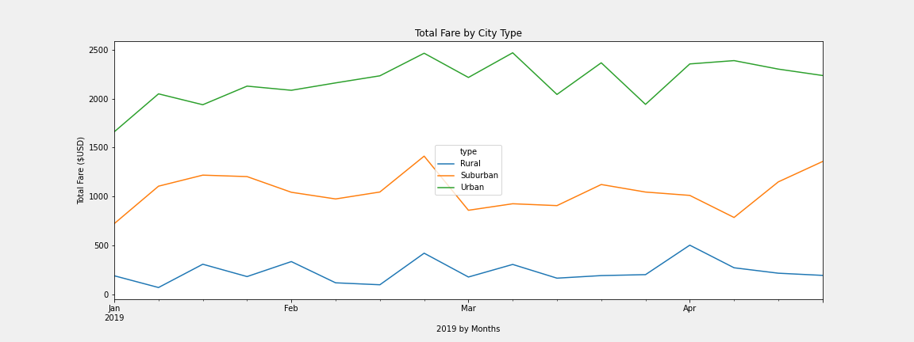

# PyBer_Analysis
## Overview 
PyBer is a company that built a ride sharing app. The executives at PyBer requested an exploratory analysis of two datasets: city data and ride data. I merged these two datasets using Python scripts in Jupyter notebook with the Pandas libraries. Then I used Matplot lib to visualize the relationship between the type of city, number of riders and drivers, and total fares.  

## Results

The PyBer data categorized cities into three types: Urban, Suburban, Rural. Using the group.by function, I could create this dataframe to compare the relationship between the total roads, drivers, and fares per ride.

In comparing the number of total rides by city type: Urban cities led (1,625 total rides), followed by Suburban (625 total rides), and lastly Rural cities (125 total rides).
The relationship of total drivers by city type also followed the number of rides relationship with once again Urban cities leading (2,405 drivers), followed by Suburban (490 drivers), and lastly Rural cities (78 drivers). 
The sum of fares in each city type also led with Urban cities ($39k), then Suburban ($19k), and lastly Rural cities ($4k)

Knowing urban cities are more densely population, it makes sense that the total rides, drivers, and fares directly correlates to the size of the city type.  The higher demand in larger cities for ride sharing would mean more rides, drivers, and more total fares.

Total fares was directly proportional to the city size, total rides, and total drivers.

The average fares had in inverse relationship ith the size of the city. The largest cities had the lowest fares with Urban average fare per ride at $25 per ride, Suburban $31 per ride and rural $35 per ride. 

The average fare per driver was also negatively correlated to the city type and number of drivers. With less drivers came higher average fares per driver. Urban ($17 / driver). Suburban ($40 / driver). Rural ($55 / driver)

Why do larger cities are more rides, drivers and fares?
Why do larger cities have lower fares per ride and per driver?

Is this because of demand? Larger cities = more people = more demand for rides = more drivers = more fares. 

For example, the ride distance was not captured in this analysis, so if fares are calculated based on rates, we could assume the distance plaied a part in the lower fares.

## Summary
The Pyber city and ride data analysis showed strong relationships between city type, total rides, drivers, and fares. As a business, PyBer should consider which city types have the most demand, market size, and most profit, so advertising, marketing, and sales efforts can focus on the highest business priorities and drive outcomes. 

One key aspect of ride sharing data is ride distance, which was not captured in this data. Incorporating some distance measures could help inform what length of rides are the sweet spot for business, to focus efforts on these types of ride sharing.

Looking deeper into the driver data could also share some key metrics to see if a large percentage of the rides and fares are managed by a small group of drivers (outliers) or more evenly paced. Pricing competitive fares could encourage more drivers in less populous areas, like rural areas, to have more options and lower the cost for consumers, and hopefully increase demand.
